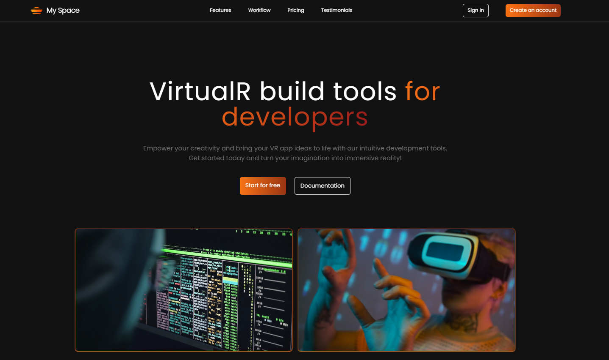

## VR Landing Page (React) - Fully Responsive

## Preview:
visit my website and let me know the responses on web to implement more features!
https://myspacevr.netlify.app

## Subject
This project is a fully responsive VR landing page built with React. It aims to showcase a virtual reality experience or product.

## Features:
- Immersive Design: (Optional) Utilizes React components and potentially libraries like Three.js to create an engaging VR-inspired user experience.
- Compelling Hero Section: Introduces the VR concept with a captivating visual element and a clear call to action.
- Benefits and Information: Highlights the key advantages and functionalities of the VR experience.
- Responsive Design: Ensures the landing page adapts seamlessly to various devices (desktop, mobile, tablets).
- Built with React: Leverages the power of React for a dynamic and interactive landing page.

## Technologies Used:
- React
- HTML5
- CSS3
- JavaScript

## Setup Instructions:
- Clone this repository.
- Install required dependencies: npm install
- Run the development server: npm start (This might vary depending on your project setup)

## Deployment:
(Optional) If you plan to deploy the landing page to a hosting platform, add specific instructions here.

## Contribution:
Feel free to fork this repository and contribute your improvements!

## Author: Kartheek Lenka
